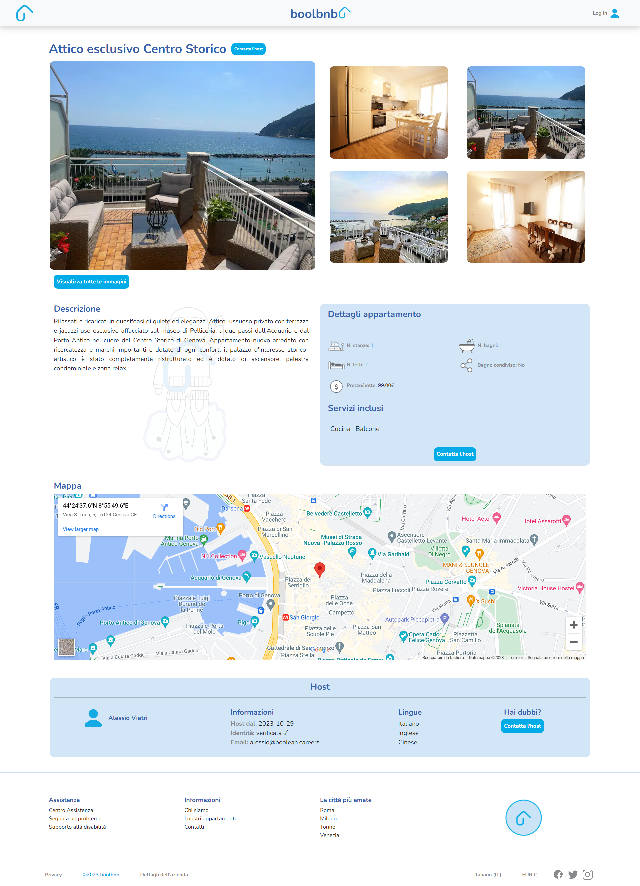

BoolBnb - sito di prenotazione appartamenti vacanze

Frontend gestito con:
  - Javascript e framework Vue 3
  - Vue Router per il routing e la navigazione delle pagine
  - Axios per le chiamate API 
  - Html, Scss e libreria Bootstrap

Il layout è responsive: sia per desktop che per smartphone.

Visualizzazione dei singoli appartamenti con la possibilità di ricercare per città tramite l'applicativo di TOM-TOM.

Possibilità di inviare un messaggio all'host. Il messaggio verrà salvato all'interno del database dell'host.

HOMEPAGE:

SINGLE PAGE APT:

